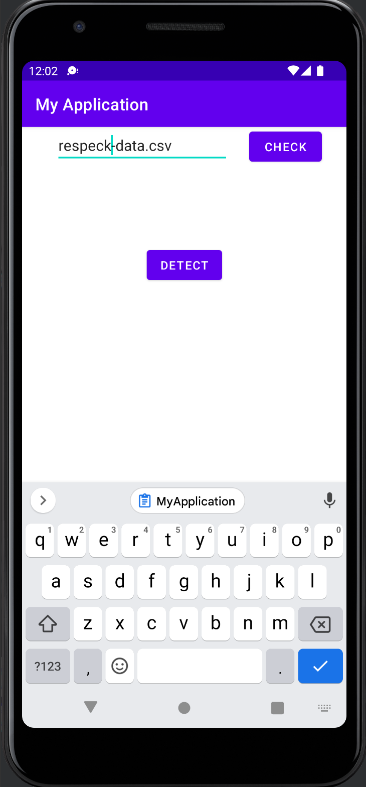
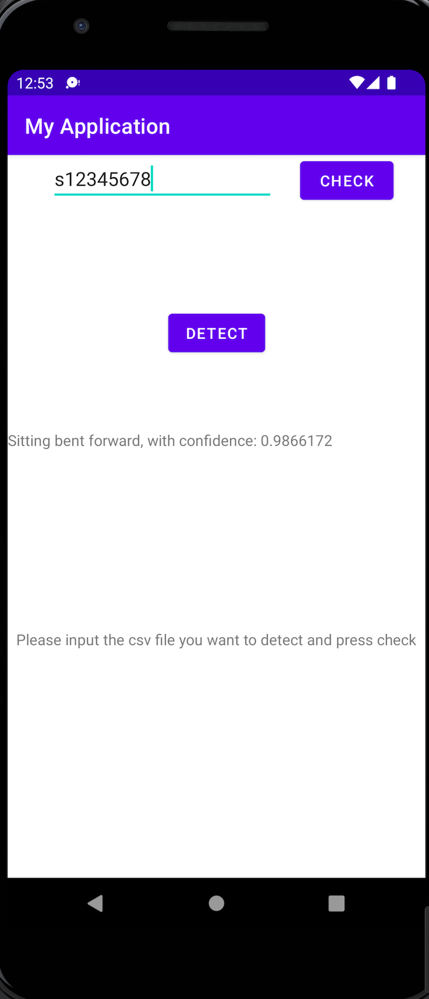

# PDIOT_TeamD
## PDIOT Prototype
Models of different window_size(1-sec, 2-sec, 5-sec, 10-sec) for faster classification.

##  App Layout
<!-- 
**detect and check button and input csv file**
 -->

**check button and input csv file**     |  **detect button for prediction**
:------------------------------------:|:-------------------------------------------:
 |  
